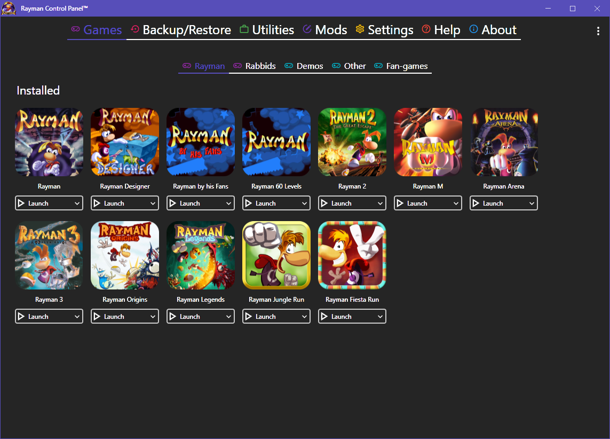
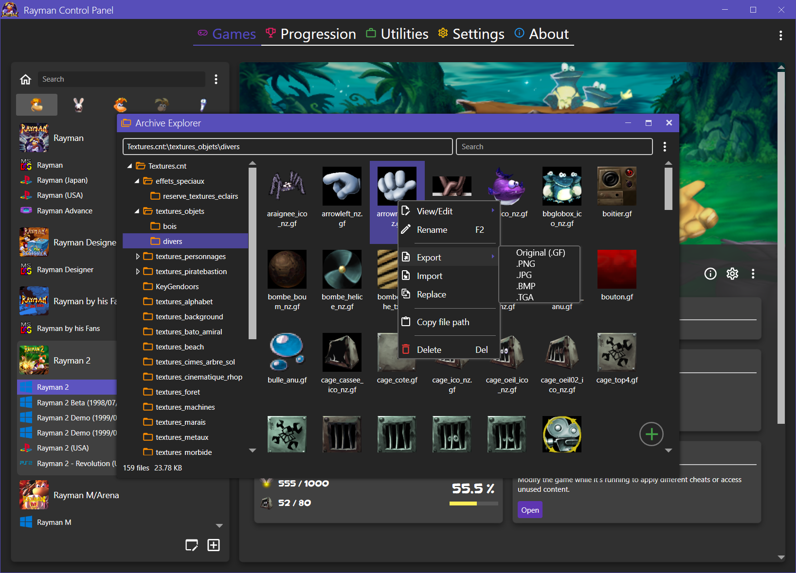
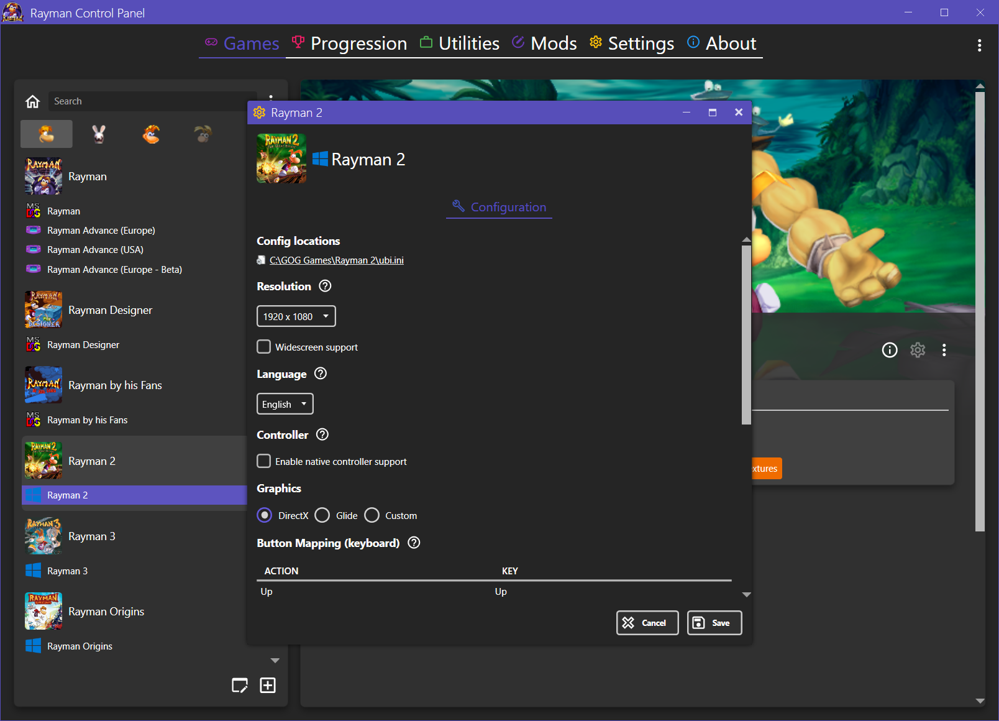
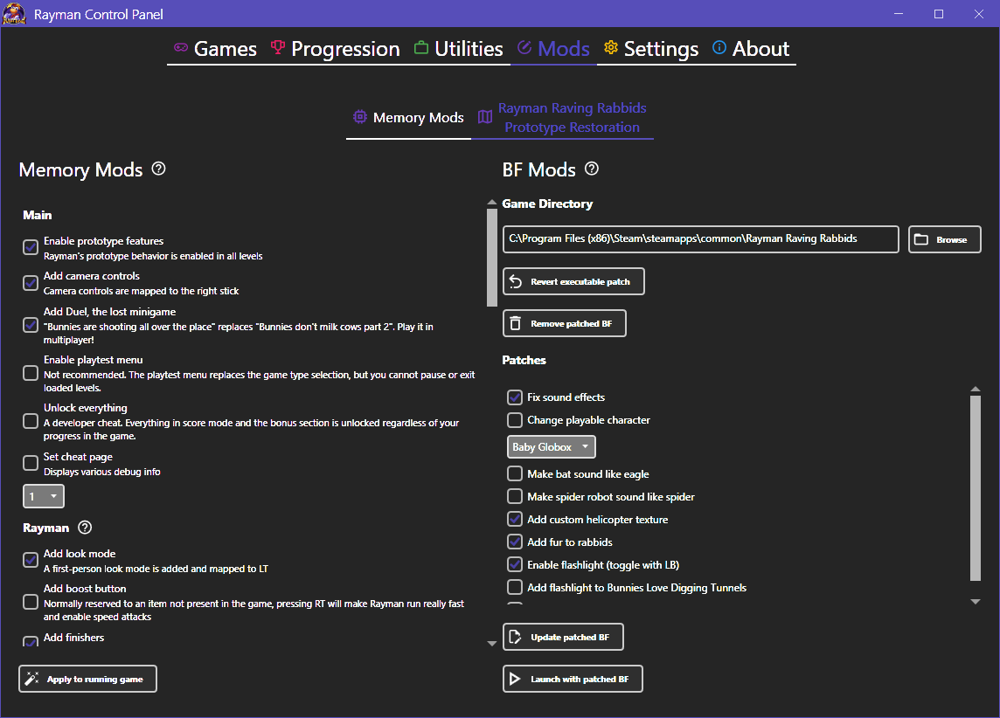
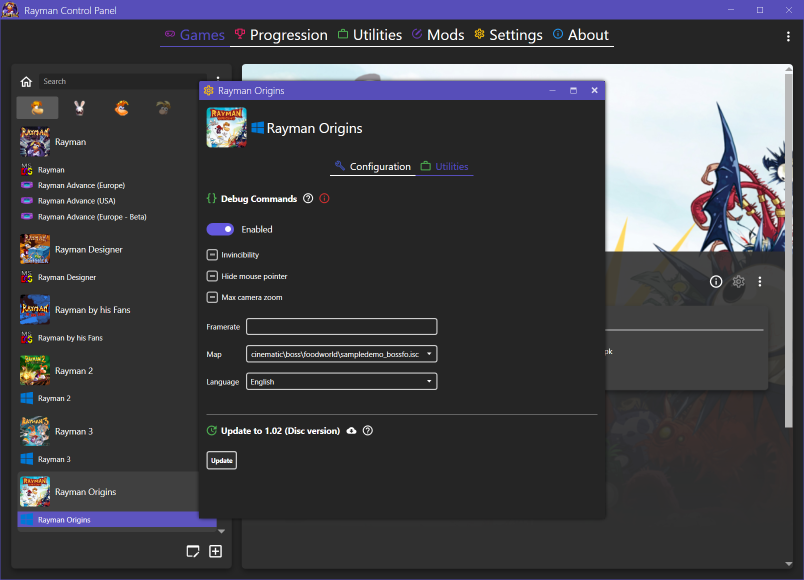

# Rayman Control Panel™

Rayman Control Panel™ is an open source community project created by [RayCarrot](https://github.com/RayCarrot). The purpose of this program is to unify existing game patches and fixes, as well as allowing extended configuration, for all PC Rayman games. This program does not come with any games and requires the user to have them installed. For certain games it is possible installing them through the program using a game disc.

Note: This repository is only for the WPF version (4.0.0 and above). The WinForms version (1.0.0 - 3.2.2) repository has since been made private as it's no longer being maintained and is heavily outdated.

# Features
Main features:
- Launcher for the PC Rayman games
- Extended game configuration support
- Game utilities, such as allowing per-level soundtrack in Rayman 1
- Save data backup/restore tool
- Disc installers to install select games from discs
- General utilities, such as the Archive Explorer to modify archive files
- Mods, such as enabling prototype features in Rayman Raving Rabbids

## Archive Explorer™

The Archive Explorer™ is a tool within the Rayman Control Panel™ which allows supported game archive files to be viewed and edited. This allows textures to be replaced in games. 

Supported archive file types:
- Rayman 1 .dat files
- OpenSpace .cnt files
- UbiArt .ipk files

## Configuration

Each supported game has a configuration page where its settings can be changed. This allows for more options than the native configuration tools each game has, such as being able to run Rayman Raving Rabbids in windowed mode and change the language for Rayman 1.

## Mods

Different mods are available throughout the app, such as restoring unused prototype features in Rayman Raving Rabbids.

## Utilities

Utilities allows for more advanced modifications to the games, usually aimed at fixing a certain issue or allowing additional features. In Rayman Origins and Legends it can be used to enable the debug commands.

## Progression

Most games have a page for viewing the progress in each save slot. The save data can also be exported to a JSON file.

# Dependencies
The Rayman Control Panel™ uses these main dependencies:

### WPF
- [MahApps.Metro](https://github.com/MahApps/MahApps.Metro)
- [MahApps.Metro.SimpleChildWindow](https://github.com/punker76/MahApps.Metro.SimpleChildWindow)
- [MahApps.Metro.IconPacks.Material](https://github.com/MahApps/MahApps.Metro.IconPacks)
- [Infralution.Localization.Wpf](https://www.codeproject.com/Articles/35159/WPF-Localization-Using-RESX-Files)
- [gong-wpf-dragdrop](https://github.com/punker76/gong-wpf-dragdrop)
- [Microsoft.Xaml.Behaviors.Wpf](https://github.com/Microsoft/XamlBehaviorsWpf)
- [XamlAnimatedGif](https://github.com/XamlAnimatedGif/XamlAnimatedGif)
- [AutoCompleteTextBox](https://github.com/quicoli/WPF-AutoComplete-TextBox)
- [WPFTextBoxAutoComplete](https://github.com/Nimgoble/WPFTextBoxAutoComplete)

### Other
- [ByteSize](https://github.com/omar/ByteSize)
- [Costura.Fody](https://github.com/Fody/Costura)
- [DotNetZip](https://github.com/haf/DotNetZip.Semverd)
- [NLog](https://github.com/NLog/NLog)
- [Magick.NET](https://github.com/dlemstra/Magick.NET)
- [Microsoft.PowerShell.5.ReferenceAssemblies](https://www.nuget.org/packages/Microsoft.PowerShell.5.ReferenceAssemblies)
- [Microsoft.Windows.SDK.Contracts](https://www.nuget.org/packages/Microsoft.Windows.SDK.Contracts)
- [Microsoft-WindowsAPICodePack-Shell](https://github.com/contre/Windows-API-Code-Pack-1.1)
- [Newtonsoft.Json](https://github.com/JamesNK/Newtonsoft.Json)
- [Nito.AsyncEx](https://github.com/StephenCleary/AsyncEx)
- [PropertyChanged.Fody](https://github.com/Fody/PropertyChanged)
- [Resource.Embedder](https://github.com/MarcStan/Resource.Embedder)
- [ini-parser](https://github.com/rickyah/ini-parser)

# Localization
From version 4.1.0 the Rayman Control Panel™ supports localized strings. For more information and information on how to contribute with translations, check out the Steam discussion page:
[Rayman Control Panel - Localization](https://steamcommunity.com/groups/RaymanControlPanel/discussions/0/1812044473314212117/)

# Contact
You can contact me on the following places:

- [Twitter](https://twitter.com/RayCarrot)
- [Email](mailto:RayCarrotMaster@gmail.com)

# Licence

[MIT License (MIT)](./LICENSE)