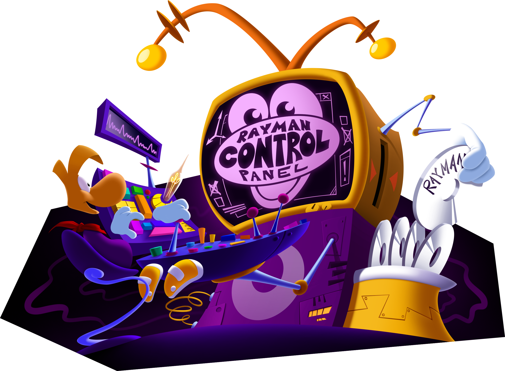
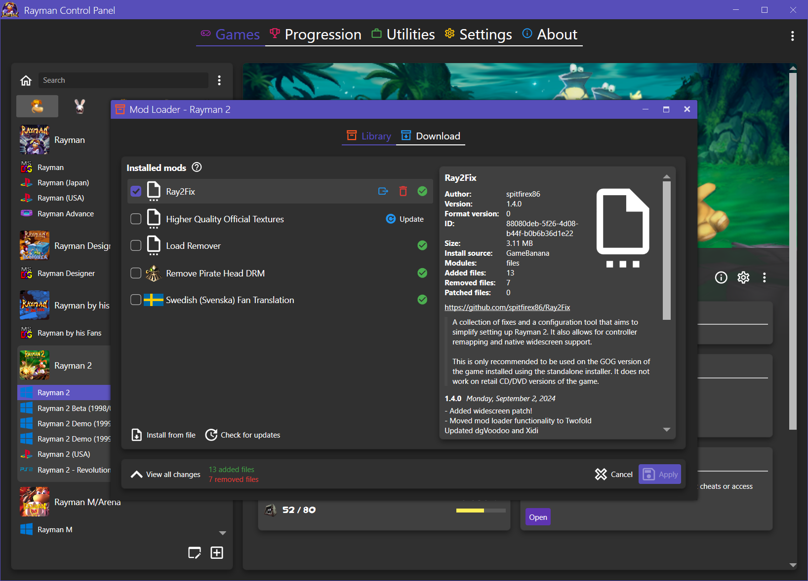
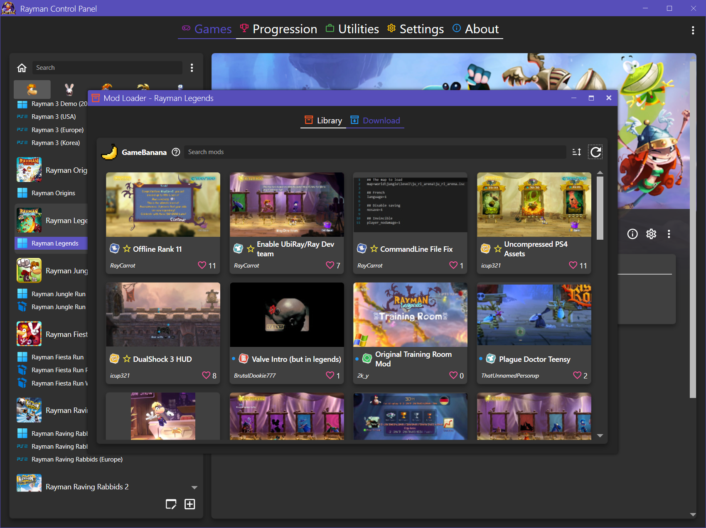
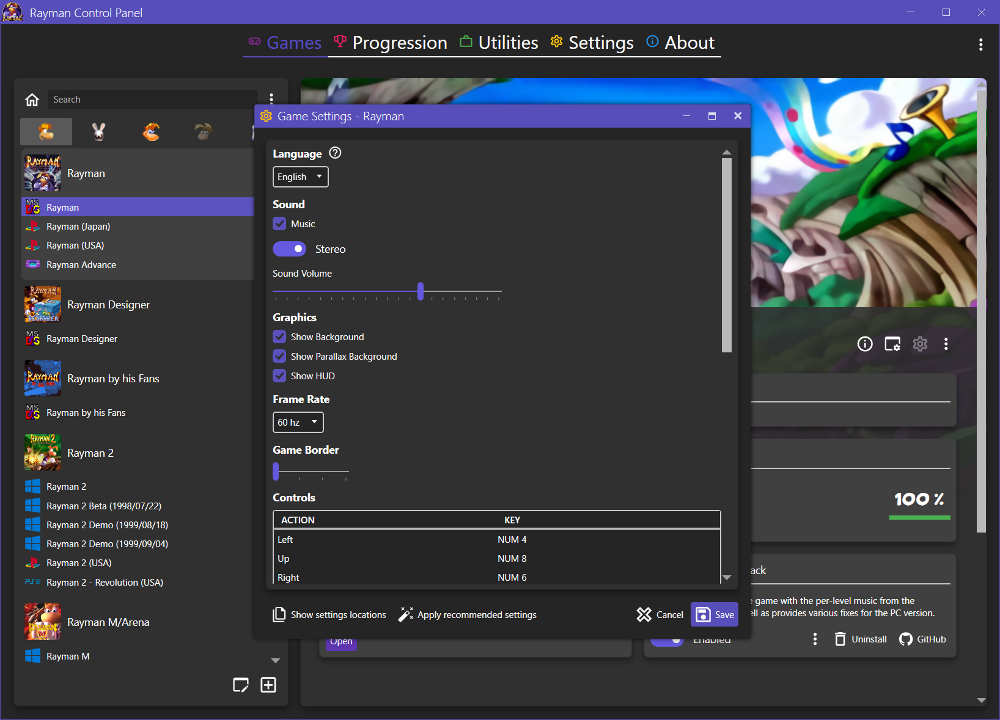
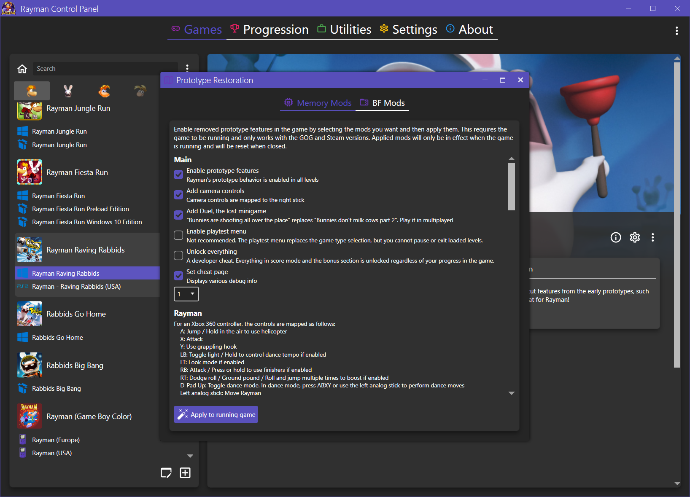
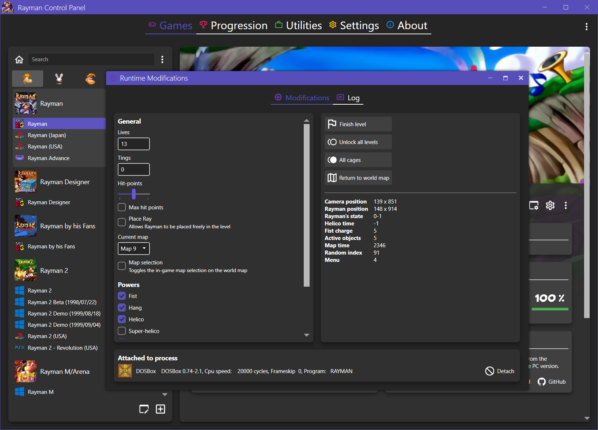
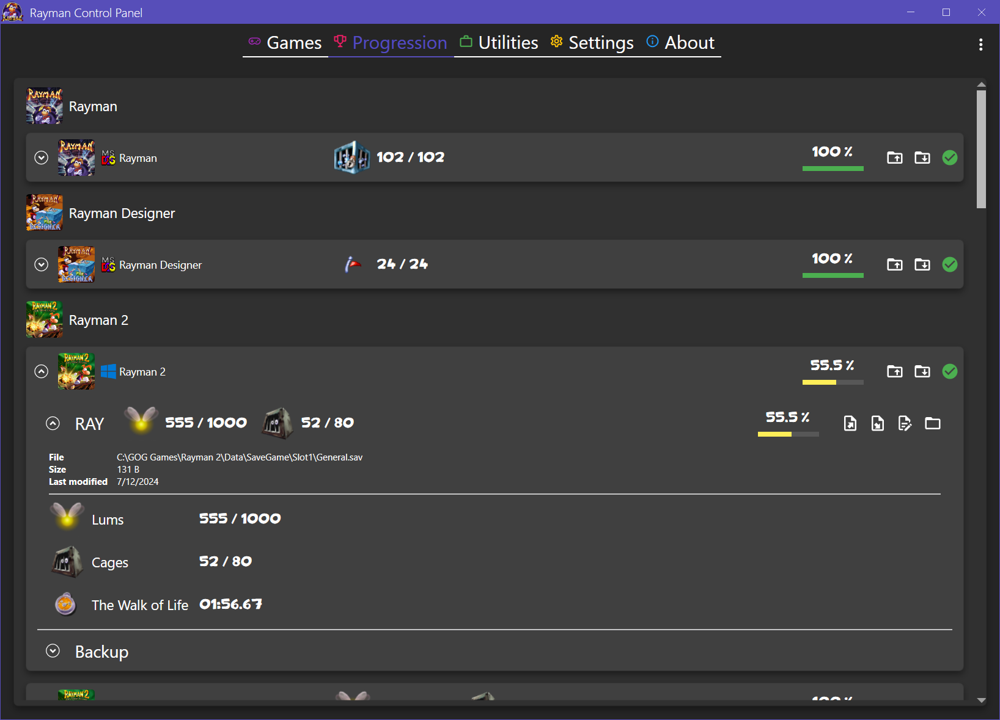

# Rayman Control Panel

    

Rayman Control Panel is an open source community project created by [RayCarrot](https://github.com/RayCarrot). It acts as a launcher for your Rayman games, and also aims to unify existing game patches and fixes, as well as allowing extended configurations. It also provides a modding environment for modifying game files and creating and downloading mods. This program does not come with any games and requires the user to have them installed. For certain games it is possible installing them through the program using a game disc.

Check out the [wiki](https://github.com/RayCarrot/RayCarrot.RCP.Metro/wiki) for documentation on the project and its features.

Note: This repository is only for the WPF version (4.0.0 and above). The WinForms version (1.0.0 - 3.2.2) repository has since been made private as it's no longer being maintained and is heavily outdated.

> [!TIP]
> Download the latest release [here](https://github.com/RayCarrot/RayCarrot.RCP.Metro/releases/latest).

# Features

Main features:
- Launcher for Rayman games
- Extended game configuration support
- Setup game actions, showing recommended steps for setting up the games, as well as potential issues
- Mod loader with GameBanana integration
- Game tools, such as allowing per-level soundtrack in Rayman 1 and restoring prototype features in Rayman Raving Rabbids
- Save data viewing and editing, along with backup/restore options
- Disc installers to install select games from discs
- Options to modify game files, such as editing the .ipk or .cnt archives

## Mod Loader

The mod loader allows you to create and install mods which modify the game in different ways. These can be file replacements, delta patches or game-specific changes. Mods uploaded to [GameBanana](https://gamebanana.com/) can be downloaded directly through the app.

For more information about creating and using mods, see the [documentation](https://github.com/RayCarrot/RayCarrot.RCP.Metro/wiki/Mod-Loader).

## Archive Explorer

The Archive Explorer is a tool within the Rayman Control Panel which allows supported game archive files to be viewed and modified. This is mainly used to replace textures in games, but can also be used for other file types such as sounds and more.

Supported archive file types:
- Rayman 1 `.dat` files
- CPA `.cnt` files
- UBIArt `.ipk` files

## Configuration

Supported games have a configuration page where its settings can be changed. This usually allows for more options than the native configuration tools each game has, such as being able to enable controller support, run in windowed mode or change the language.

## Tools

Different game-specific tools are available, such as the Prototype Restoration mod for Rayman Raving Rabbids and the Per-Level Soundtrack mod for Rayman 1.

Select games also support runtime modifications, which allows certain data in the game to be modified as its running, such as the number of lives or which level you're currently in. This can sometimes also be used to toggle unused features.

## Progression

Detailed game save progression can be viewed, along with options to edit the data as serialized JSON and create/restore backups. 

# Dependencies
The Rayman Control Panel uses these main dependencies:

### BinarySerializer (sub-modules)
- [BinarySerializer](https://github.com/BinarySerializer/BinarySerializer)
- [BinarySerializer.Audio](https://github.com/BinarySerializer/BinarySerializer.Audio)
- [BinarySerializer.Disk](https://github.com/BinarySerializer/BinarySerializer.Disk)
- [BinarySerializer.Nintendo](https://github.com/BinarySerializer/BinarySerializer.Nintendo)
- [BinarySerializer.PlayStation](https://github.com/BinarySerializer/BinarySerializer.PlayStation)
- [BinarySerializer.Ray1](https://github.com/BinarySerializer/BinarySerializer.Ray1)
- [BinarySerializer.OpenSpace](https://github.com/BinarySerializer/BinarySerializer.OpenSpace)
- [BinarySerializer.UbiArt](https://github.com/BinarySerializer/BinarySerializer.UbiArt)

### WPF
- [MahApps.Metro](https://github.com/MahApps/MahApps.Metro)
- [MahApps.Metro.SimpleChildWindow](https://github.com/punker76/MahApps.Metro.SimpleChildWindow)
- [MahApps.Metro.IconPacks.Material](https://github.com/MahApps/MahApps.Metro.IconPacks)
- [Infralution.Localization.Wpf](https://www.codeproject.com/Articles/35159/WPF-Localization-Using-RESX-Files)
- [gong-wpf-dragdrop](https://github.com/punker76/gong-wpf-dragdrop)
- [Microsoft.Xaml.Behaviors.Wpf](https://github.com/Microsoft/XamlBehaviorsWpf)
- [XamlAnimatedGif](https://github.com/XamlAnimatedGif/XamlAnimatedGif)
- [AutoCompleteTextBox](https://github.com/quicoli/WPF-AutoComplete-TextBox)
- [WPFTextBoxAutoComplete](https://github.com/Nimgoble/WPFTextBoxAutoComplete)

### Other
- [CommunityToolkit.Mvvm](https://github.com/CommunityToolkit/dotnet)
- [Costura.Fody](https://github.com/Fody/Costura)
- [DirectXTexNet](https://github.com/deng0/DirectXTexNet)
- [Magick.NET](https://github.com/dlemstra/Magick.NET)
- [Microsoft.Windows.SDK.Contracts](https://www.nuget.org/packages/Microsoft.Windows.SDK.Contracts)
- [Microsoft-WindowsAPICodePack-Shell](https://github.com/contre/Windows-API-Code-Pack-1.1)
- [Newtonsoft.Json](https://github.com/JamesNK/Newtonsoft.Json)
- [Nito.AsyncEx](https://github.com/StephenCleary/AsyncEx)
- [NLog](https://github.com/NLog/NLog)
- [PropertyChanged.Fody](https://github.com/Fody/PropertyChanged)
- [Resource.Embedder](https://github.com/MarcStan/Resource.Embedder)
- [SharpCompress](https://github.com/adamhathcock/sharpcompress)

# Localization
From version 4.1.0 the Rayman Control Panel supports localized strings. For more information and information on how to contribute with translations, check out the Steam discussion page:
[Rayman Control Panel - Localization](https://steamcommunity.com/groups/RaymanControlPanel/discussions/0/1812044473314212117/)

# Contact
You can contact me on the following places:

- [Bluesky](https://bsky.app/profile/raycarrot.bsky.social)
- [Email](mailto:RayCarrotMaster@gmail.com)

# License

[MIT License (MIT)](./LICENSE)
